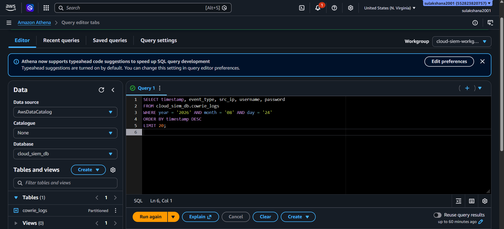
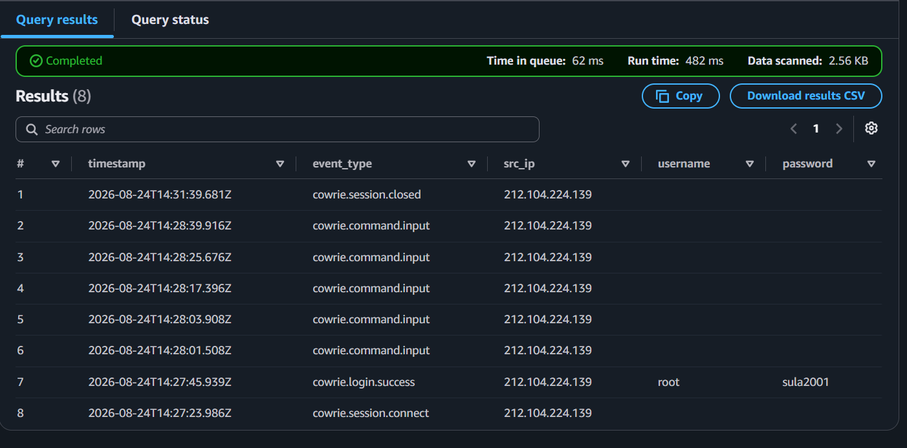
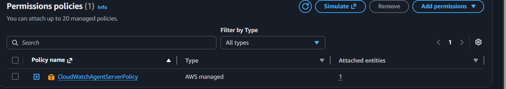

# 🍯 Cloud SIEM Honeypot


A **fully automated, production-style cloud threat intelligence pipeline** built on AWS.

A live Cowrie SSH/Telnet honeypot captures real attacker activity from the public internet. Every login attempt, command run, and malware download is automatically streamed to CloudWatch, normalized by a serverless Lambda function, stored in a partitioned S3 data lake, and queryable via Athena for threat hunting. The entire infrastructure is provisioned with Terraform — zero manual console clicks.

---

## 🏗️ Architecture

```
Internet (Attackers)
        │
        │  SSH brute-force on :2222 / Telnet on :23
        ▼
┌─────────────────────────────────────────┐
│  AWS VPC  10.10.0.0/16  (Isolated)      │
│  ┌──────────────────────────────────┐   │
│  │  EC2 t3.micro · Ubuntu 22.04     │   │
│  │  ┌────────────────────────────┐  │   │
│  │  │  Cowrie Honeypot (:2222)   │  │   │
│  │  │  Accepts any credentials   │  │   │
│  │  │  Logs all commands         │  │   │
│  │  └──────────┬─────────────────┘  │   │
│  │             │ cowrie.json         │   │
│  │  ┌──────────▼─────────────────┐  │   │
│  │  │  CloudWatch Agent          │  │   │
│  │  │  (tails log file live)     │  │   │
│  │  └──────────┬─────────────────┘  │   │
│  └─────────────┼────────────────────┘   │
└───────────────-┼────────────────────────┘
                 │ PutLogEvents
                 ▼
        CloudWatch Logs  /honeypot/cowrie
                 │
                 │ Subscription Filter (push)
                 ▼
        Lambda: CowrieLogNormalizer
        (decode gzip → normalize → partition)
                 │
                 ▼
        S3 Data Lake:  logs/year=/month=/day=/
                 │
          ┌──────┴──────┐
          ▼             ▼
       Athena       (Phase 5: ELK)
    Threat Hunting   Kibana SIEM
```

---

## 🛠️ Technology Stack

| Layer | Technology | Purpose |
|---|---|---|
| Infrastructure | **Terraform** | Entire AWS stack as code — reproducible in minutes |
| Compute | **AWS EC2 t3.micro** | Hosts the honeypot, Ubuntu 22.04 |
| Honeypot | **Cowrie** | Medium-high interaction SSH/Telnet honeypot |
| Log Streaming | **AWS CloudWatch Agent** | Tails cowrie.json → ships to CloudWatch in real time |
| Processing | **AWS Lambda (Python 3.10)** | Serverless normalizer triggered by CloudWatch |
| Storage | **AWS S3** | Encrypted, partitioned data lake |
| Query Layer | **AWS Athena + Glue** | Serverless SQL threat hunting on the data lake |
| IAM | **AWS IAM** | Least-privilege roles for every service |

---

## 📸 Screenshots

### ☁️ CloudWatch — Raw Logs Streamed Off-Box in Real Time


### ⚡ CloudWatch Agent — Shipping Logs to AWS


### 🪣 S3 Data Lake — Hive-Partitioned Normalized Events


### 🔍 Athena — Threat Hunting Query


### 📊 Athena — Real Attacker Data Results


### 🏗️ Terraform — Full Infrastructure as Code


### 🛡️ IAM — Least Privilege (CloudWatch Write-Only)


---

## 📋 Phase Status

| Phase | What | Status |
|---|---|---|
| **Phase 1** | Terraform VPC + EC2 + Security Groups | ✅ Complete |
| **Phase 1** | Cowrie Honeypot installed as systemd service | ✅ Complete |
| **Phase 2** | IAM Role (least privilege) + CloudWatch Agent | ✅ Complete |
| **Phase 3** | Lambda log normalizer → S3 Data Lake | ✅ Complete |
| **Phase 4** | Glue Catalog + Athena workgroup + threat hunting SQL | ✅ Complete |
| **Phase 5** | ELK Stack SIEM with Kibana dashboards | ⏳ Planned |
| **Phase 6** | SOAR — Lambda auto-banning attacker IPs via WAF | ⏳ Planned |

---

## 🔐 Security Design

| Principle | Implementation |
|---|---|
| **Network Isolation** | Dedicated VPC with no peering to any production environment |
| **Least Privilege IAM** | EC2 role → CloudWatch write only. Lambda role → S3 PutObject only |
| **Admin Lockdown** | Port 22 restricted to operator IP via Security Group |
| **Tamper-Resistant Logs** | CloudWatch streams data off-box before attacker can delete it |
| **Non-root Honeypot** | Cowrie runs as the `cowrie` system user, never as root |
| **Zero Real Secrets** | All credentials inside Cowrie are synthetic/fake |
| **Encrypted Storage** | S3 data lake uses AES-256 server-side encryption |

---

## 📡 What the Honeypot Captures

Every event is normalized to this schema and stored in S3:

```json
{
  "timestamp":  "2024-01-15T14:23:01.000Z",
  "source":     "cowrie-honeypot",
  "event_type": "cowrie.login.failed",
  "session_id": "abc123def456",
  "src_ip":     "198.51.100.42",
  "src_port":   54321,
  "dst_port":   2222,
  "username":   "root",
  "password":   "admin123"
}
```

**Captured event types:**

| Event | What it tells you |
|---|---|
| `cowrie.session.connect` | Who connected, from where |
| `cowrie.login.failed` | Credential spray attempts (username + password tried) |
| `cowrie.login.success` | Attacker got through auth — high-value session |
| `cowrie.command.input` | Post-login recon & attack commands |
| `cowrie.session.file_download` | Malware download URL + SHA256 hash |
| `cowrie.session.closed` | Session end — calculate duration |

---

## 🔍 Sample Threat Hunting Queries

```sql
-- Top attacking IPs
SELECT src_ip, COUNT(*) AS attempts
FROM cloud_siem_db.cowrie_logs
WHERE event_type = 'cowrie.login.failed'
GROUP BY src_ip ORDER BY attempts DESC LIMIT 10;

-- Most tried credentials
SELECT username, password, COUNT(*) AS tries
FROM cloud_siem_db.cowrie_logs
WHERE event_type = 'cowrie.login.failed'
GROUP BY username, password ORDER BY tries DESC LIMIT 20;

-- Commands run after successful login
SELECT timestamp, src_ip, command
FROM cloud_siem_db.cowrie_logs
WHERE event_type = 'cowrie.command.input'
ORDER BY timestamp DESC;
```

Full query set: [`docs/athena_queries.sql`](docs/athena_queries.sql)

---

## 🚀 Setup & Deployment

### Prerequisites
- AWS account with programmatic access configured (`aws configure`)
- Terraform >= 1.0
- An EC2 key pair created in your target region

### 1. Clone and configure
```bash
git clone https://github.com/YOUR_USERNAME/cloud-siem-honeypot.git
cd cloud-siem-honeypot/terraform
cp terraform.tfvars.example terraform.tfvars
```

Edit `terraform.tfvars`:
```hcl
aws_region = "us-east-1"
your_ip    = "YOUR.PUBLIC.IP.HERE/32"   # find at whatismyip.com
key_name   = "your-ec2-keypair-name"
```

### 2. Deploy infrastructure
```bash
terraform init
terraform plan    # review what will be created
terraform apply   # deploy (~2 min)
```

### 3. Install Cowrie on the EC2
```bash
# Get the public IP from Terraform output
terraform output honeypot_public_ip

# SSH in
ssh -i your-key.pem ubuntu@<PUBLIC_IP>

# Run the install script
curl -sSL https://raw.githubusercontent.com/YOUR_USERNAME/cloud-siem-honeypot/main/scripts/install_cowrie.sh | bash
```

### 4. Verify the pipeline
```bash
# On EC2 — check Cowrie is running
sudo systemctl status cowrie

# Watch live attacker events (bots find you within minutes)
sudo journalctl -u cowrie -f
```

In AWS Console:
- **CloudWatch** → Log Groups → `/honeypot/cowrie` → should have live log streams
- **S3** → `cloud-siem-datalake-*` → check for files under `logs/`
- **Athena** → select workgroup `cloud-siem-workgroup`, database `cloud_siem_db` → run queries

### 5. Tear down (avoid AWS charges)
```bash
terraform destroy
```

---

## 💰 Estimated AWS Cost

| Resource | Cost |
|---|---|
| EC2 t3.micro | ~$0.0104/hr ≈ **$7.50/month** |
| S3 storage | Negligible for log volumes |
| Lambda invocations | Within free tier |
| CloudWatch ingestion | Within free tier for small log volumes |
| Athena queries | $5 per TB scanned (honeypot logs = pennies) |
| **Total** | **~$8–10/month** |

---

## 📁 Project Structure

```
cloud-siem-honeypot/
├── terraform/
│   ├── main.tf          # VPC, EC2, Security Groups, IAM, CloudWatch
│   ├── phase3.tf        # S3 Data Lake, Lambda normalizer
│   ├── phase4.tf        # Glue Catalog, Athena workgroup, IAM analyst policy
│   ├── variables.tf     # Input variables
│   └── outputs.tf       # EC2 public IP, bucket name
├── scripts/
│   ├── install_cowrie.sh    # Full Cowrie install + systemd setup
│   ├── setup_cloudwatch.sh  # CloudWatch Agent configuration
│   ├── lambda_function.py   # Serverless log normalizer (deployed to Lambda)
│   └── normalize_logs.py    # Local CLI normalizer for testing
└── docs/
    ├── architecture.md      # Detailed architecture with Mermaid diagram
    ├── threat-model.md      # STRIDE threat model
    └── athena_queries.sql   # 12 ready-to-run threat hunting queries
```
