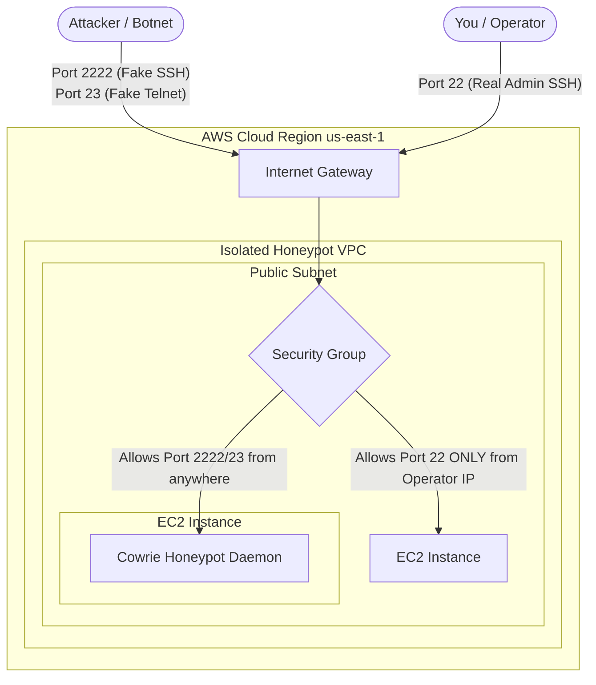

# Honeypot Architecture

This document outlines the network architecture and data flow of the Cloud SIEM Honeypot Lab.

## High-Level Design

The honeypot is deployed within a dedicated AWS Virtual Private Cloud (VPC) to ensure complete isolation from any production environments. 

### Key Components
1. **AWS Internet Gateway (IGW)**: Allows inbound traffic from the public internet to reach the honeypot.
2. **Security Group (Firewall)**: 
   - **Port 2222 (Cowrie SSH)**: Open to the world (`0.0.0.0/0`) to attract automated scanners and attackers.
   - **Port 23 (Cowrie Telnet)**: Open to the world (`0.0.0.0/0`).
   - **Port 22 (Admin SSH)**: Strictly locked down to the Operator's public IP address.
3. **EC2 Instance**: An Ubuntu server hosting the Cowrie honeypot software, running as a low-privileged background daemon.

## Architecture Diagram

