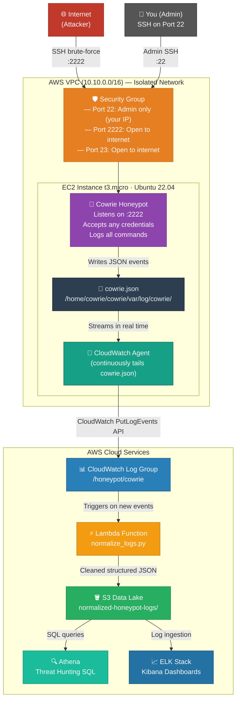

# Architecture — Cloud SIEM Honeypot

## Overview

This project implements a cloud-native Security Operations Center (SOC) pipeline on AWS.
A live SSH honeypot captures real attacker activity, and the data is automatically centralized,
normalized, and (in later phases) visualized in a SIEM dashboard.

---

## Data Flow

---

## Phase Status

| Phase | What | Status |
|---|---|---|
| **Phase 1** | Terraform VPC + EC2 + Security Groups | ✅ Complete |
| **Phase 1** | Cowrie Honeypot installed & running as systemd service | ✅ Complete |
| **Phase 2** | IAM Role (least privilege) attached to EC2 | ✅ Complete |
| **Phase 2** | CloudWatch Agent streaming `cowrie.json` to `/honeypot/cowrie` | ✅ Complete |
| **Phase 3** | Lambda function to auto-normalize logs → S3 Data Lake | 🔄 In Progress |
| **Phase 4** | Athena threat hunting queries | ⏳ Planned |
| **Phase 5** | ELK Stack SIEM with Kibana dashboards | ⏳ Planned |
| **Phase 6** | SOAR — Lambda "Bouncer" auto-banning attacker IPs | ⏳ Planned |

---

## Security Design Principles

| Principle | Implementation |
|---|---|
| **Isolation** | Dedicated VPC with no peering to any production account |
| **Least Privilege** | IAM Role grants CloudWatch write-only, nothing else |
| **Admin Lockdown** | Port 22 restricted to operator IP via Security Group |
| **Tamper-Resistant Logs** | CloudWatch streams data off-server before attacker can delete it |
| **Non-root Honeypot** | Cowrie runs as the `cowrie` system user, never as root |
| **Zero Real Secrets** | All credentials inside Cowrie are synthetic/fake |
